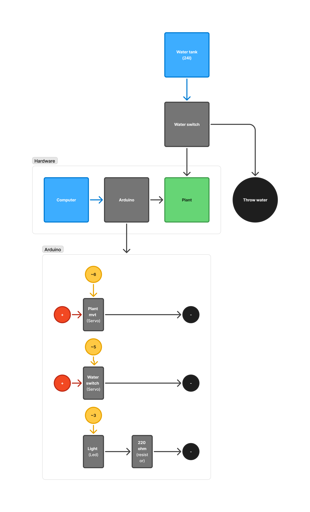

# Plant Lens

Making the water consumption of language models visible through plants.

## Lancer le projet

### Installer Homebrew

Si Homebrew n'est pas installé, l'installer avec la commande:

```bash
  /bin/bash -c "$(curl -fsSL https://raw.githubusercontent.com/Homebrew/install/HEAD/install.sh)"
```

### Installer Ollama

Intaller Ollama et télécharger le modèle gemma3:1b.

```bash
  brew install ollama
  ollama pull gemma3:1b
```

### Installer node.js & yarn

Installer node.js avec Homebrew:

```bash
  brew install node
  brew install yarn
```

### Lancer le serveur et le client

```bash
  cd client/
  yarn install
  yarn dev
```

```bash
  cd server/
  yarn install
  yarn dev
```

### Brancher l'Arduino ou ouvrir Chrome

1. Brancher l'Arduino en USB.
2. Ouvrir Google Chrome.
   1. Un onglet à l'adresse: `localhost:5173` pour connecter l'Arduino.
   2. Un onglet à l'adresse: `localhost:5173/llm` pour le chat.

Il est possible d'envoyer des comandes directement à l'Arduino via l'onglet `localhost:5173/remote`.

## Important

L'API Web Serial ne fonctionne qu'avec Microsoft Edge et Google Chrome (et les navigateurs basés sur Chromium).

## Brancher le Arduino



## Liste du matériel

- Arduino Uno
  - Câble USB A
  - Breadboard
  - Résistances 220Ω
  - Servo moteur (2x)
  - Câbles électriques (~5m)
  - LED blanche
- Réservoir d'eau (24L)
  - Tuyau en silicone (6mm de diamètre intérieur) (~4m)
- Ordinateur
- Lumière diffuseur (optionnel)
- Plante en pot (ex: Pothos, Ficus, etc.)
- Étagères ou support pour l'installation plante
