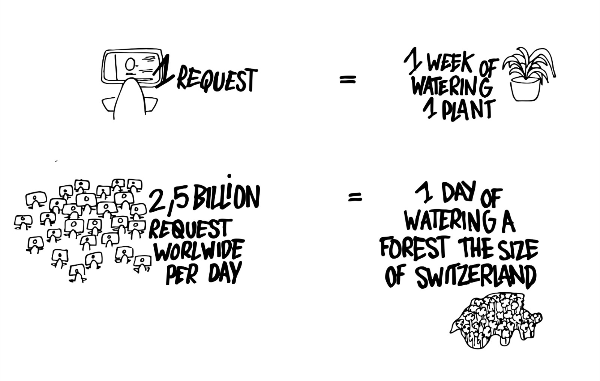
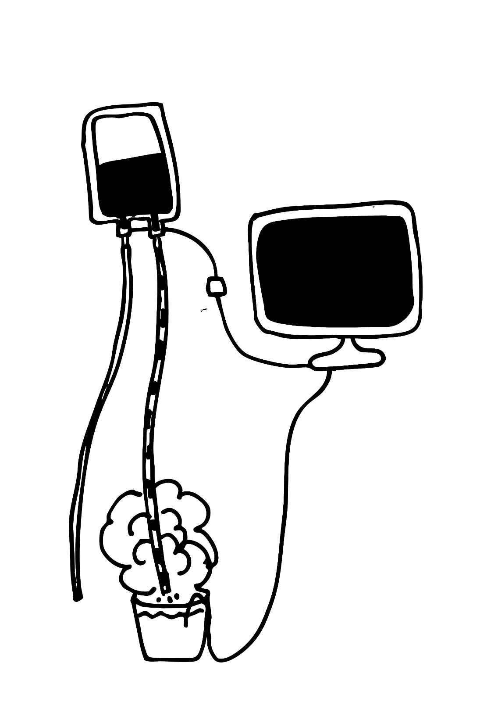
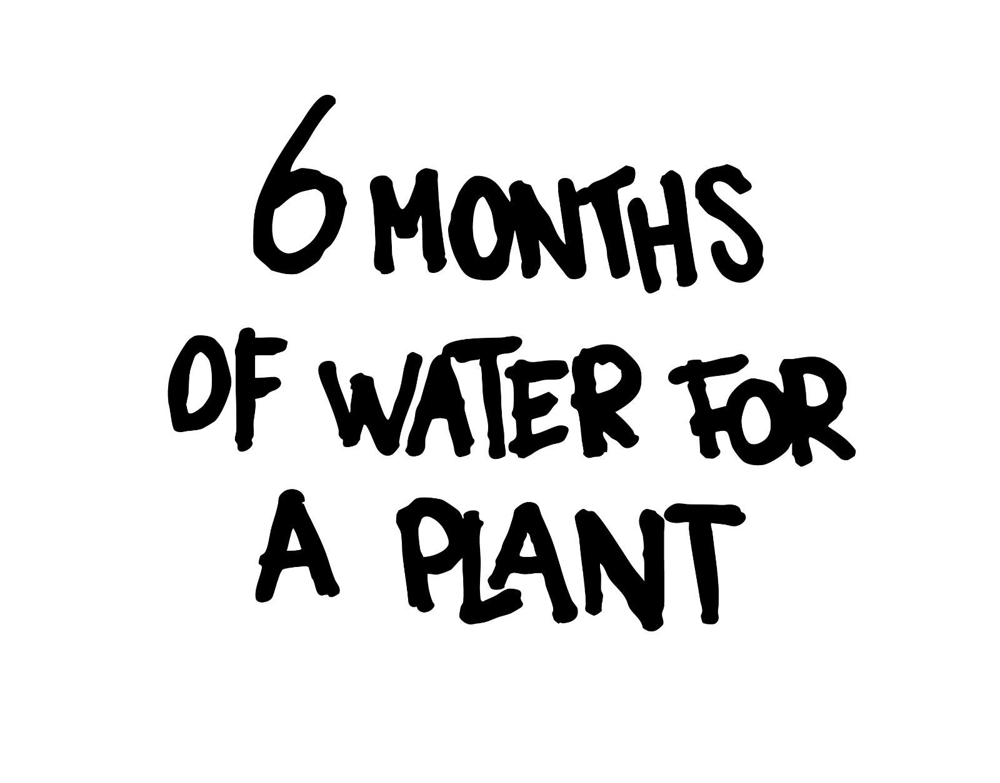

# Press Kit

_Images and video available in [the asset folder](./assets)._

## Plant Lens

Making the water consumption of language models visible through plants.

### Summary

Plant Lens is a speculative installation that makes the water consumption of language models perceptible through a living organism. By linking digital interactions to the hydration of an indoor plant, the project translates an invisible environmental cost into a physical and tangible process. The plant becomes a fragile unit of measurement — a lens through which the material impact of computation can be observed. Plant Lens questions technological delegation, progress, and ecological responsibility by proposing an interface that encourages restraint rather than optimization.

## Presentation

### Overview

Plant Lens is a speculative robotic installation that makes the environmental cost of language models perceptible by translating computational activity into plant hydration. By linking digital interactions to a living organism, the project exposes the hidden water consumption behind contemporary AI systems and questions our relationship to technological delegation, progress, and care.

Rather than proposing a solution, Plant Lens functions as a critical lens: a device that shifts attention from abstract computation to material, ecological consequences.

### Initial intention

The project started from a desire to make visible a noumenon — an environmental phenomenon that exists but remains imperceptible at a given moment in time.

Several directions were explored, including:

- redistributing sunlight through robotic mirrors,
- guiding bodily movement through thermal feedback,
- and creating new forms of interaction with indoor plants.

Indoor plants ultimately became the focus, as they embody a paradox: living organisms integrated into domestic spaces, yet disconnected from natural ecosystems, rhythms, and networks.

### Plants as a non-anthropocentric interface

Plants offered a way to shift perspective away from human-centered interaction.
They live on different temporal scales, move slowly, and express change through subtle transformations rather than immediate feedback.

Inspired by research on plant intelligence (Mancuso, Bridle) and by speculative approaches to more-than-human design, the project reframed plants as living indicators.

The plant becomes a lens through which technological systems are observed.

### Research and references

The conceptual framework draws from multiple domains:

**Ecology & biology**

- Mycorrhizal networks and the idea of distributed intelligence in living systems
- Research on plant sensitivity and communication (Mancuso, Backster, Bridle)

**Robotics & technology**

- Critical perspectives on AI, techno-solutionism, and computational excess
- Gauthier Roussilhe’s Phase G, describing the ecological cost of GPU-driven growth

**Art & design**

- Projects that reveal invisible phenomena through translation rather than explanation
  (e.g. Translator, Desert Songs, Synthetic Pollinator, Breeze)

**Fiction & cinema**

- Nausicaä of the Valley of the Wind, as a narrative about humanity's inability to listen to non-human systems

### From sensing to symbolism

Early experiments explored direct sensing of plants through capacitive sensors, soil sensors, light sensors, and ECG-like measurements. These tests revealed an important limitation: while environmental data is accessible, the inner state of a plant remains fundamentally ambiguous.

This led to a conceptual shift.
Rather than attempting to "listen" to plants, the project chose to speak through them.

The plant becomes a symbolic and material proxy — a fragile, finite body that can be affected by remote, abstract actions.

### The water–computation link

In its final form, Plant Lens connects computational activity to water flow.

Each interaction with a language model corresponds to a symbolic extraction from a plant’s annual water reserve. The act of computation is translated into a physical gesture: water moving through a visible perfusion system connected to the plant.

Water functions here as:

- a vital resource,
- a shared ecological currency,
- and a reminder that digital systems are never immaterial.

The installation does not aim for scientific accuracy, but for experiential clarity: computation has consequences, even when they are geographically and temporally displaced.

### A robot that discourages its own use

Unlike most interactive systems, Plant Lens is designed to resist engagement.
The more it is used, the more it depletes a living resource.

In this sense, the system performs a reversal of technological logic:

- efficiency becomes harmful,
- restraint becomes meaningful,
- non-use becomes a form of care.

The robot is not an assistant, but a moral interface.

### Outcome

Plant Lens exists as a speculative artefact, an interactive installation, and a performative demonstration. It does not propose an optimized future, but instead invites reflection on the cost of progress and the forms of intelligence we choose to amplify.

By grounding abstract computation in a living organism, the project asks a simple but uncomfortable question:

What are we willing to drain in order to keep delegating thought to machines?

### How it works

