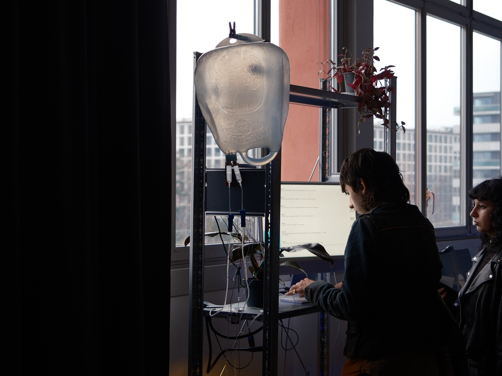

# Soft Robotics

Sentinelle environnementale. Cet atelier explore le concept de robots souples, écologiques et sensibles ; des robots agissant comme des agents de soin et d'observation. Des éco-machines spéculatives qui interrogent notre relation à la technologie, à l'écologie et à la vie non humaine.

## Plant Lens

## Ma tendre eau, ma chère eau, je suis navré.

Navré pour cette époque où l’on compte les données plus vite que les gouttes.
Où la machine apprend, calcule, prédit,
pendant que l’eau s’évapore en silence.

Le constat écologique est là. Brutal.
L’eau se gaspille,
pendant que les centres de données s’abreuvent.

Cathédrales numériques refroidies par des torrents invisibles.
Un tsunami silencieux de systèmes de refroidissement
dont la soif fait trembler la planète.

Ici, nous proposons autre chose.
Un temps d’attention.
Un ralentissement.
Un regard posé sur l’eau,
sur une plante,
sur un organisme vivant.

Une réserve pensée pour durer un an.
Un an de survie pour une plante fragile.
Une perfusion minimale
dans un monde sous assistance artificielle.

Mais la machine décide autrement.

À chaque requête formulée,
à chaque sollicitation du modèle,
l’eau s’écoule.

Elle n’irrigue rien.
Elle ne nourrit pas.
Elle ne sauve pas.

Elle disparaît.

Un gaspillage à échelle réduite.
Écho direct d’une catastrophe bien plus vaste.

Une démonstration absurde, presque anodine,
de la violence systémique
d’un progrès déconnecté du vivant.

La machine continue.
La plante attend.
L’eau s’épuise.

Et nous, nous regardons.
