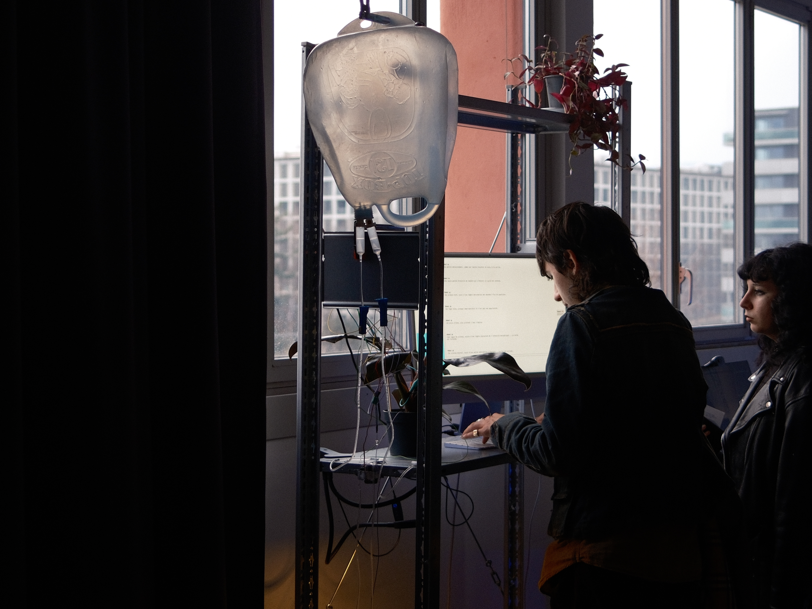
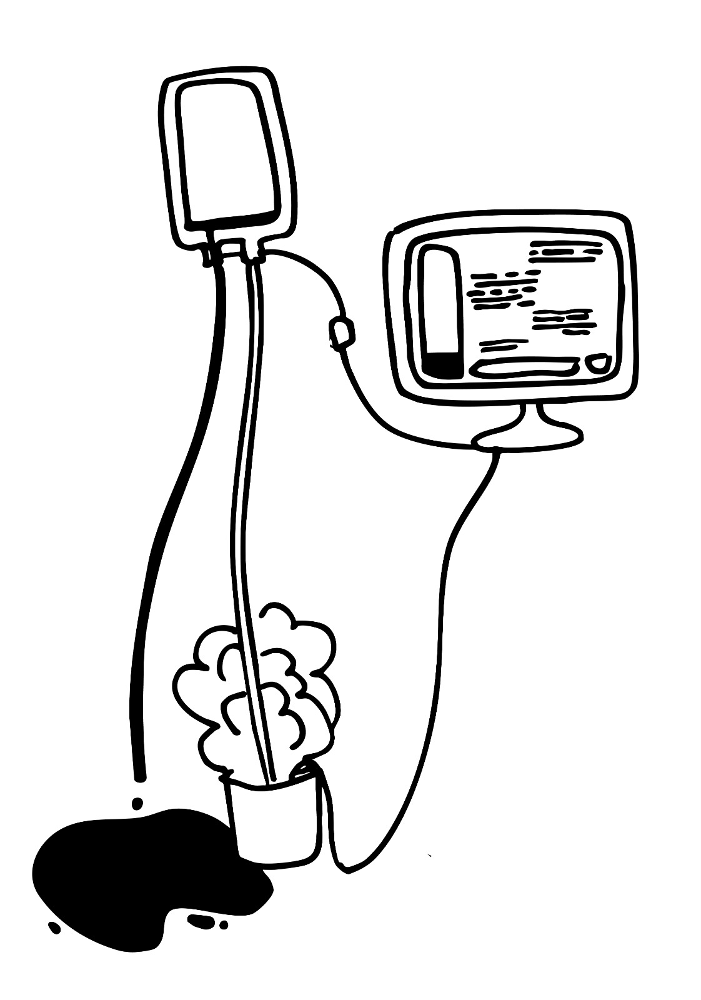

# Soft Robotics

Sentinelle environnementale. Cet atelier explore le concept de robots souples, écologiques et sensibles ; des robots agissant comme des agents de soin et d'observation. Des éco-machines spéculatives qui interrogent notre relation à la technologie, à l'écologie et à la vie non humaine.

## Plant Lens

### Fonctionnement

