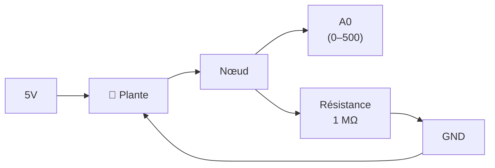
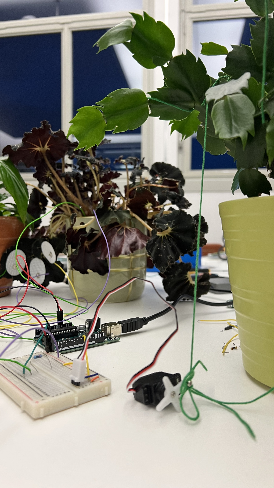

## Plant Sensor

Mesurer le niveau d'humidité de la terre et faire bouger un servo moteur aléatoirement si le niveau d'humidité est en dessous de 100/500.

## Ressources

- [Muscle Sensor](https://learn.sparkfun.com/tutorials/myoware-muscle-sensor-kit/all) - electrode ECG prévu pour les muscles humains

## Capteur d'humidité des sol "DIY"

La plante est reliée au 5V et au GND.
Renvoie une valeur entre 0 (sec) et 500 (eau).

## Résultat

